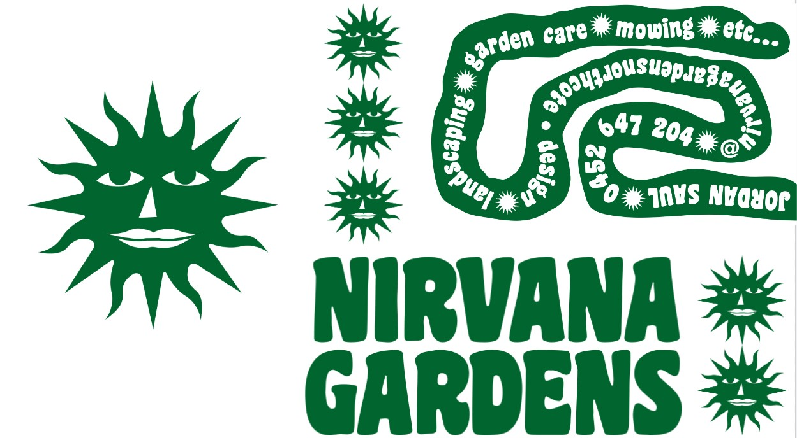
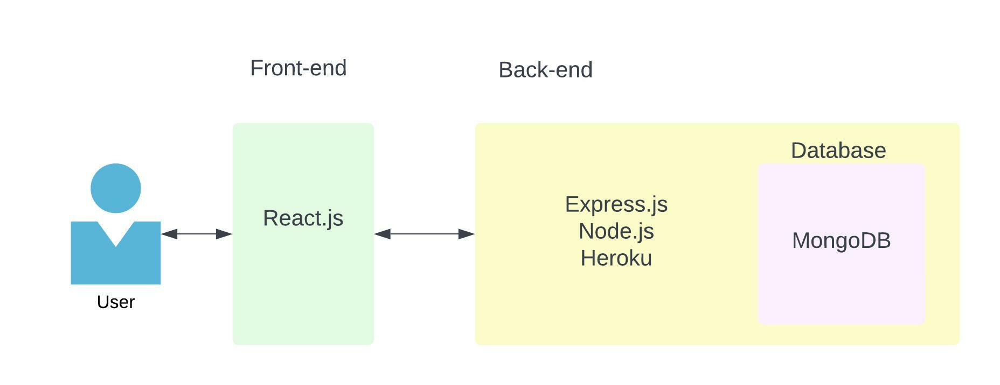
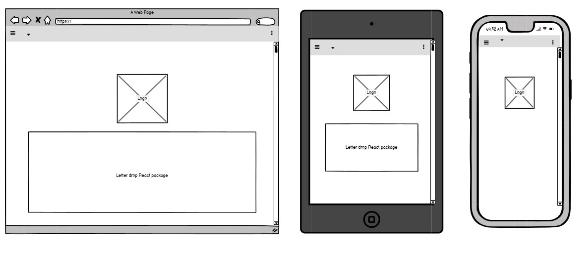
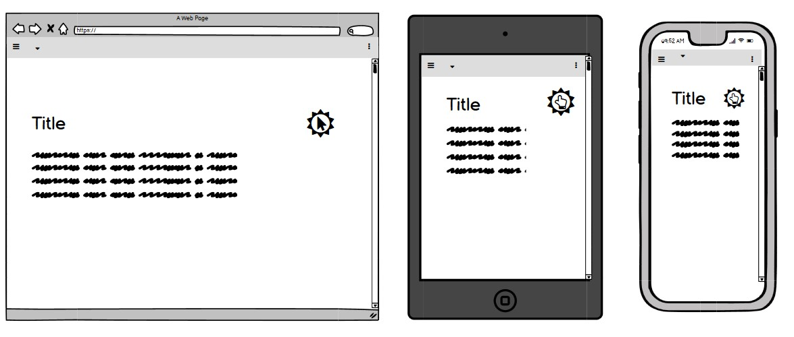
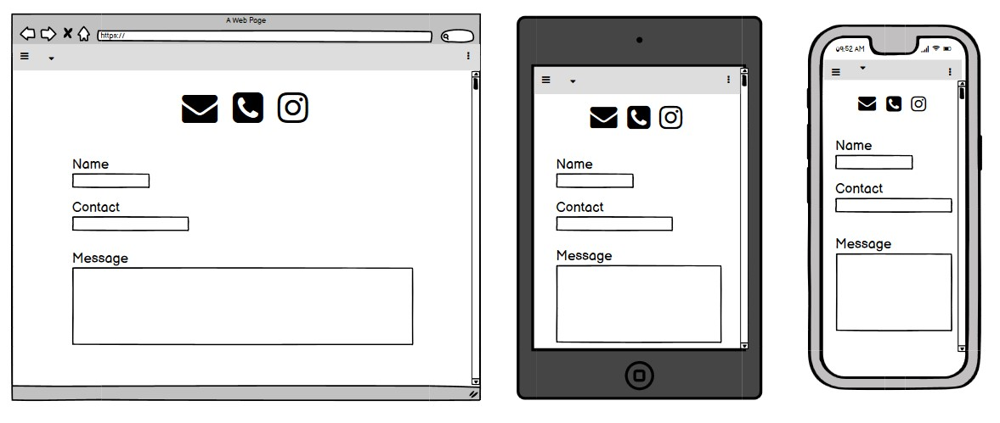
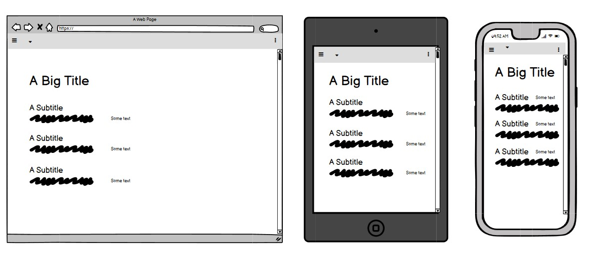
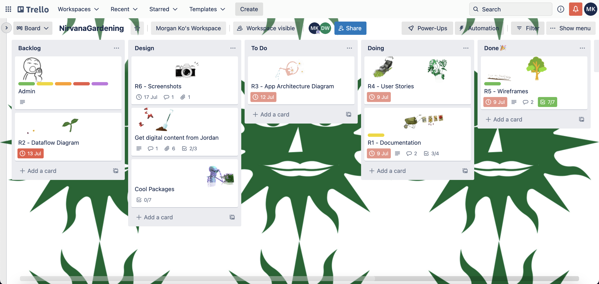
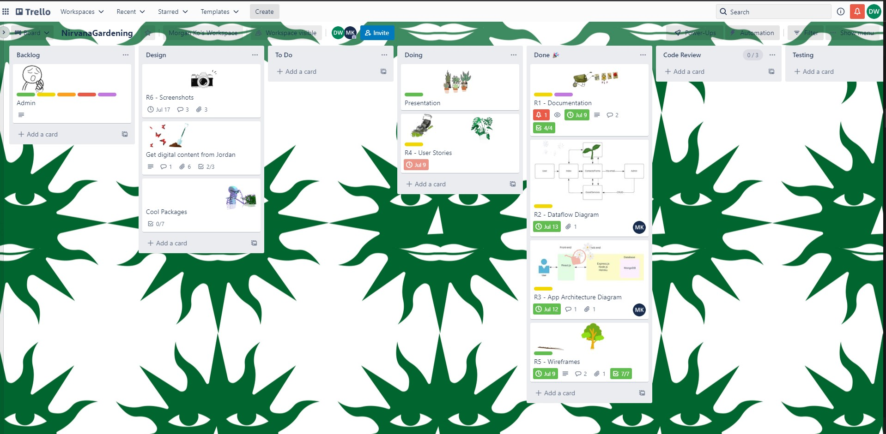
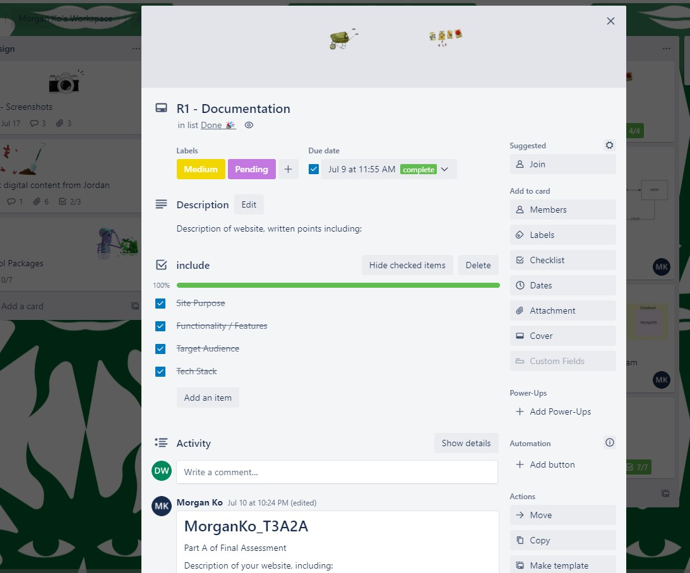
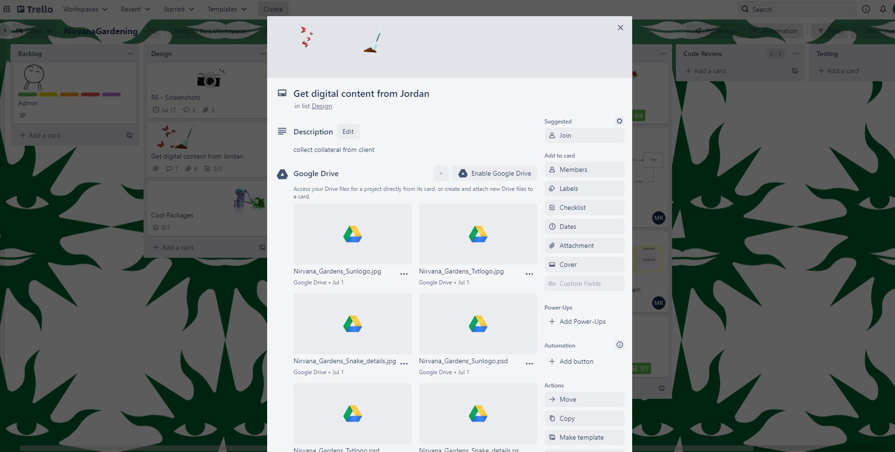

# Nirvana_Gardens

-------------------------- 

[Nirvana Gardens](https://desolate-shelf-45706.herokuapp.com/)
[Server](https://young-plains-02409.herokuapp.com/)

-------------------------- 

<h1>Purpose</h1>

To create an joyful but official landing for the landscaping business, Nirvana Gardens. This “digital garden” will allow customers, potential and existing, to find information regarding the business and act as a portfolio for the emerging landscape design side to the business.

Jordan has asked us to find fun ways to engage people on the page with reference to the joys of nature and personal gardens.

-----------------------

<h1>Functionality/Features</h1>
Core Features:

- Landing / Home page - Fun interactive elements

- About - Info about Jordans horticulture studies

- Contacts Details - Inquiry forms

- Design Services - Portfolio of previous work

- Maintenance Services - List of services 

Within the Landing / Home page, a logo with an interactive React package (leter drop) will be displayed. Horizontal navbar present for navigation.

In the About page, another interactive React package (random walkers) will be utilised to keep users engaged while learning about the owners of the business. Further information regarding jordans education and experince, as well as some personality.

In Contact Details, a list of ways to connect with the owners will be outlined with hyperlinks (E.g. Social Media, Email, Phone number,...). A pre-generated form will also be available for customers/clients to easily send their query.

In Design Services, a fun but contempory profile on jordans landscaping services offered alongside examples of prior work. Additionally, a further React package (TBD) will also be implemented.

In Maintenance Services, a simple profile on the maintenance services the business offeres and any possibly goods will be presented here.

There will also be an implementation of User Authentication so that the owners are able to make small modification to the written content on the website.

----------------------------

<h1>Target Audience</h1>

The target audience of this website will be clients (business and personal) within the Inner Melbourne area. They are looking to enlist a garden maintenance proffesional (folks with mobility requirments, or individuals who dont have the time to perform maintenance on their garden. They typically have mid to high income due to their location) on a semi regular basis, or individuals/businesses looking for design and landscaping services. 

------------------------------

<h1>Tech Stack</h1>

- HTML5 (Markup language)
- Javascript (Programming language)
- MongoDB (Open source cross-platform document-oriented database program)
- Express.js (Open source back end web application framework for Node.js)
- React (Open source front end library for building UI components)
- Node.js (Open-source cross-platform back-end JavaScript runtime environment)
- Heroku (Cloud based deployment platform)
- GitHub (Version control hosting)
- Trello (Workflow Management)
- VS code (Text Editor)

----------------------------

<h1>Dataflow Diagram</h1>

-------------------------------

<h1>Application Architecture Diagram</h1>

---------------------------------

<h1>User Stories</h1>

- Hospitality / Public Business venue:

As a busy inner city hospitality business with disposable income, We want to be able to enlist a contemporary landscape designer to update our tired outdoor area into an inviting space.

- High Income, Time poor new homeowners:

As a busy high earning couple, We want to re-do our new home garden through a landscaper and find examples of past client work for reference.

- Mature aged folks:

As a retired person with low mobility, I want to have access to a gardeners service regularly for general maintenance and some light updating. Plus I love bees.

-------------------------------

<h1>Wireframes and Design</h1>

---------------------------------

<h1>Workflow - Trello</h1>

-------------------------------------------

<h1> User Testing </h1>

A sample size of 10 people were used in conducting User testing/research when designing and implementing functions within the website.
The tests utilised for Nirvana Gardens was A/B testing and a Card sort/ranking to help identify which features were most important to our client's prospective customers and best liked. 

An A/B test was conducted to find the most ideal UI features. To not overwhelm our participants, we provided limited options (typically two but no more than three) so that they could choose their preferred options. Collaboratively with our client, where there were little to no difference, our client's opinion was weighed significantly higher. This test assisted in finalising the presentation/front end of the website.

A Card sort/ranking test was conducted to find the most important UX features. With six options, with a 1 denoting most important and a 6 denoting least important, participants ranked what they felt was the most important feature to them. Similar to A/B testing, where differences were minute, client opinion was prioritised. This test assisted in allocating resources to the development of these features.

Finally, we asked our research group their final opinions, which was mostly positive. This process highlighted how well received our client's vision was, allowing us to adapt the process throughout development and implementation, resulting in a product that both meets our client's needs/expectations and appeals to the customer.

Attached below are screenshots of collated responses.

